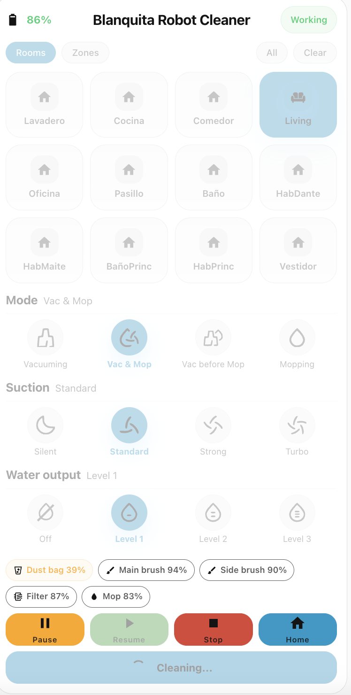
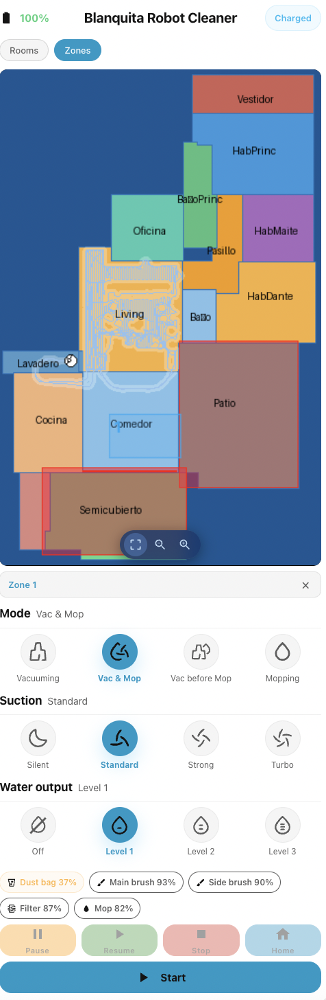
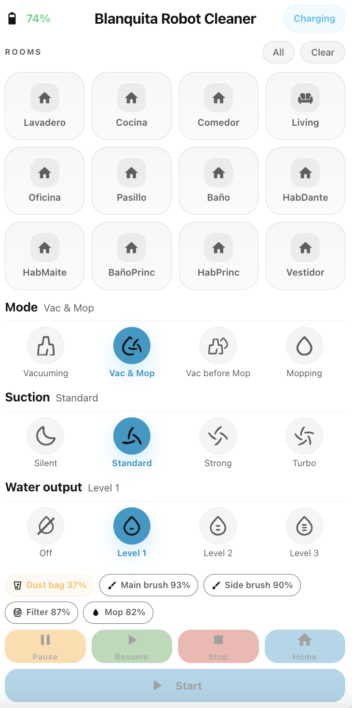

# Xiaomi Robot Vacuum Card (OV21GL)

A custom Lovelace card for Home Assistant with full room-by-room control and zone cleaning drawn directly on the live map.

This is an independent fork of [tojolab/xiaomi-robot-vacuum-card](https://github.com/tojolab/xiaomi-robot-vacuum-card), significantly redesigned and extended to support the **Xiaomi Robot Vacuum 5 Pro (OV21GL)** and the [xiaomi_cloud_map_extractor](https://github.com/luchusnet/Home-Assistant-custom-components-Xiaomi-Cloud-Map-Extractor) integration. It goes beyond a simple patch — the card was refactored to support map-based zone cleaning, improved state detection, model-specific quirks, and a cleaner UI.

---

## Screenshots

### Cleaning in progress — Rooms mode

The card while the vacuum is actively cleaning. **Rooms** tab is active, one room is selected (highlighted in blue). The status chip shows **Working**, the action buttons are active, and the Start button shows **Cleaning...** in progress.



---

### Zones mode — drawing a cleaning zone on the live map

The **Zones** tab active with the live floor plan visible. A rectangle has been drawn over the "Semicubierto" area (shown with a yellow outline on the map), appearing as **Zone 1** in the list below. The vacuum is charged and the **Start** button is ready to send the zone command.



---

### Idle / Charging — ready to start

The card while the vacuum is docked and charging. No rooms are selected, all action buttons are dimmed, and the **Start** button is available. The status chip shows **Charging**.



---

## Features

- **Room selection** — tap individual rooms or use All / Clear; rooms are read from the camera entity (`xiaomi_cloud_map_extractor`) or from `vacuum_extend.room_info` (xiaomi_miot fallback)
- **Zone cleaning** — switch to the **Zones** tab, draw rectangles on the live map to define cleaning zones, then press Start. Supports multiple zones per session.
- **Map zoom & pan** — zoom in/out with the on-screen controls, pinch-to-zoom and 2-finger pan on touch devices
- **Mode control** — Vacuuming, Mopping, Vacuuming & Mopping, Vacuuming before mopping
- **Suction level** — Silent, Standard, Strong, Turbo
- **Water output** — Off, Level 1, Level 2, Level 3
- **Mode-aware controls** — Suction disabled when Mopping-only; Water output disabled when Vacuuming-only
- **Water tank warnings** — animated warning chips appear when clean water is empty or dirty water tank is full
- **Consumables tracking** — dust bag, main brush, side brush, filter and mop life levels shown as color-coded chips
- **Room filtering & ordering** — configure which rooms to show and in what order via `rooms:` config key
- **Custom room icons & names** — tap the edit icon in HA edit mode to customize any room
- **Auto entity discovery** — mode / suction / water select entities found automatically from the device; no manual entity IDs needed
- **Cleaning state persistence** — selected rooms and lock state survive browser refresh
- **Smart unlock detection** — cleaning lock releases as soon as the vacuum is detected as docked/charged, with sensor staleness detection as fallback

---

## Supported Hardware

### Xiaomi Robot Vacuum 5 Pro (OV21GL)
Primary target of this fork. Uses `xiaomi_miot` + `xiaomi_cloud_map_extractor`.
- Rooms are read from the camera entity's `rooms` attribute
- Room cleaning uses `xiaomi_miot` `call_action` (siid=2, aiid=16)
- Zone cleaning uses `vacuum.send_command` → `app_zoned_clean`
- Water tank warnings use `vacuum.fault` attribute (model-specific quirk)
- Zone map drawn from the live camera feed with calibration-point coordinate transform

### Xiaomi Robot Vacuum S20+ (B108GL)
Rooms are read from `vacuum_extend.room_info`. Room cleaning uses `xiaomi_miot` native actions. Zone cleaning is available when a camera entity is configured.

Other Xiaomi MiOT vacuum models may work depending on which attributes they expose.

---

## Requirements

- Home Assistant (any recent version)
- [xiaomi_miot](https://github.com/al-one/hass-xiaomi-miot) — installable via HACS

**For OV21GL / map features:**
- [xiaomi_cloud_map_extractor (OV21GL fork)](https://github.com/luchusnet/Home-Assistant-custom-components-Xiaomi-Cloud-Map-Extractor) — fork with OV21GL-specific fixes, installable via HACS custom repository

---

## Installation

### Via HACS (recommended)

1. In HACS → click **⋮** → **Custom repositories**
2. Enter `https://github.com/luchusnet/xiaomi-robot-vacuum-card` → category **Lovelace** → **Add**
3. Search for **Xiaomi Robot Vacuum Card (OV21GL)** → **Download**

### Manual

1. Download `xiaomi-robot-vacuum-card.js` from the [latest release](https://github.com/luchusnet/xiaomi-robot-vacuum-card/releases/latest)
2. Copy to `/config/www/xiaomi-robot-vacuum-card.js`
3. In HA → Settings → Dashboards → Resources, add:
   - URL: `/local/xiaomi-robot-vacuum-card.js`
   - Type: JavaScript module
4. Hard-refresh your browser (`Ctrl+Shift+R` / `Cmd+Shift+R`)

---

## Configuration

### Minimal (xiaomi_miot only)

```yaml
type: custom:xiaomi-robot-vacuum-card
entity: vacuum.your_vacuum_entity
```

The card auto-discovers mode, suction and water select entities from the same device.

### Full config — OV21GL with map

```yaml
type: custom:xiaomi-robot-vacuum-card
entity: vacuum.your_vacuum_entity
map_source:
  camera_entity: camera.your_vacuum_live_map   # from xiaomi_cloud_map_extractor
fan_select: select.your_vacuum_mode            # suction level entity (OV21GL-specific)
show_battery: true
show_status: true
rooms:                                         # optional: filter / reorder rooms
  - Living
  - Kitchen
  - Bedroom
```

> **OV21GL note:** The suction level entity is named `select.<vacuum>_mode` (options: Silent / Basic / Strong / Full Speed). Set it via `fan_select:` since auto-discovery looks for `_suction_level` suffix which this model doesn't use.

### All config options

| Key | Default | Description |
|-----|---------|-------------|
| `entity` | *(required)* | Vacuum entity from `xiaomi_miot` |
| `map_source.camera_entity` | — | Camera entity from `xiaomi_cloud_map_extractor` (enables Zones tab) |
| `fan_select` | auto | Override suction level select entity |
| `mode_select` | auto | Override clean mode select entity |
| `water_select` | auto | Override water output select entity |
| `show_battery` | `true` | Show battery chip |
| `show_status` | `true` | Show status chip |
| `title` | vacuum name | Custom card title |
| `title_mode` | `auto` | Set to `custom` to use a custom title |
| `rooms` | all rooms | List of room names or IDs to show (in order) |

---

## Zone Cleaning

When `map_source.camera_entity` is configured, a **Zones** tab appears next to Rooms.

1. Tap **Zones**
2. The live map image is displayed with an overlay canvas
3. **Draw a rectangle** by clicking/tapping and dragging — this defines one zone
4. Add multiple zones; each appears numbered in the list below the map
5. Delete individual zones with **×**
6. Tap **Start** to send all zones to the vacuum

**Coordinate transform:** zone rectangles are converted from screen pixels to vacuum coordinates using the `calibration_points` attribute from the camera entity (3-point affine transform). If calibration points are not available, raw pixel coordinates are used as fallback.

**Map controls (bottom of map):**

| Button | Action |
|--------|--------|
| Fit (⊞) | Reset zoom and pan to full view |
| − | Zoom out (0.5× step, minimum 1×) |
| + | Zoom in (0.5× step, maximum 5×) |

On touch devices: 1-finger drag draws a zone; 2-finger pinch/drag zooms and pans.

Switching back to **Rooms** clears all drawn zones and resets the map view.

---

## Troubleshooting

### Rooms not showing?
Rooms are only available after being renamed in the Xiaomi Home app. Default names (Room 1, Room 2…) are not returned by the API.

### Zones tab not showing?
Make sure `map_source.camera_entity` is set in the card config and the camera entity is available.

### Suction section not visible on OV21GL?
Add `fan_select: select.<your_vacuum>_mode` to your card config.

### Water tank warnings not showing on OV21GL?
This model reports water faults via `vacuum.fault`. Make sure you're on v1.3.0+ of this fork.

### Card shows "Working" after vacuum is docked?
The cleaning lock releases automatically once the vacuum is detected as docked or charged (after a 30-second grace period). If the status sensor is stale, the lock releases after 30 minutes.

---

## Changelog

- **v1.3.0** — Zone cleaning with map drawing; zoom/pan controls; 2-finger pinch/pan on touch; calibration-point coordinate transform
- **v1.2.0** — Rooms/Zones tab structure; `xiaomi_cloud_map_extractor` room loading; animated water tank warning chips; improved stale-sensor detection
- **v1.0.3** — Rename to `xiaomi-robot-vacuum-card`; fix stale mode unlock when docked/charged; water tank warning improvements for OV21GL; initial map extractor support

---

## Credits

- Original card: [tojolab/xiaomi-robot-vacuum-card](https://github.com/tojolab/xiaomi-robot-vacuum-card)
- Map extractor (OV21GL fork): [luchusnet/Home-Assistant-custom-components-Xiaomi-Cloud-Map-Extractor](https://github.com/luchusnet/Home-Assistant-custom-components-Xiaomi-Cloud-Map-Extractor)

---

## License

MIT — see [LICENSE](LICENSE)
